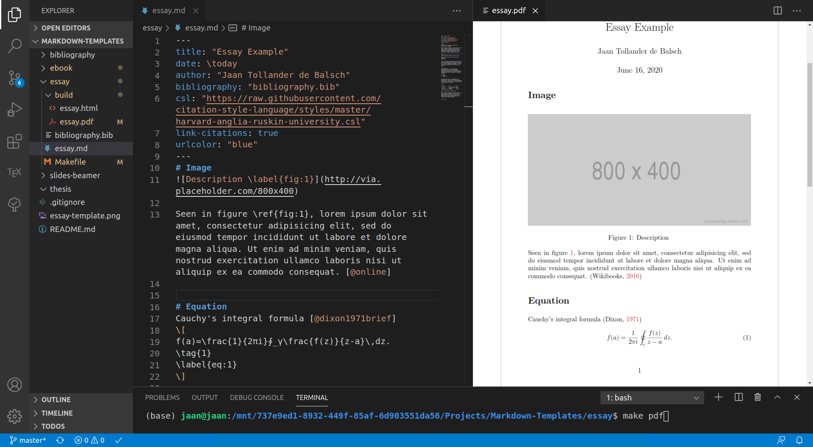
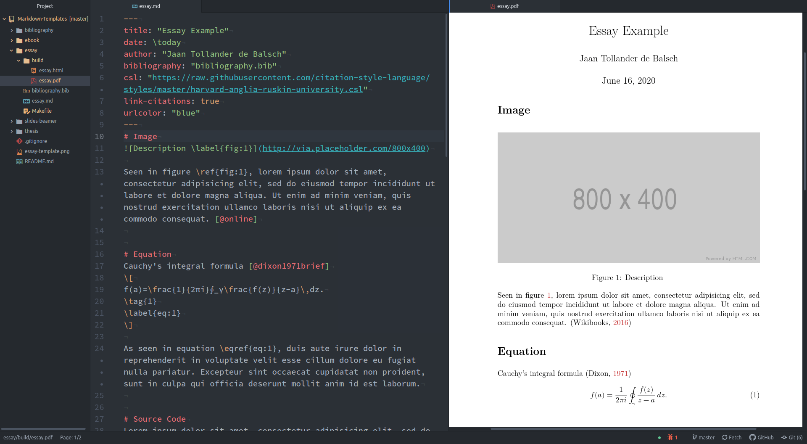

# Markdown Templates
## Introduction
This repository contains templates for creating scientific, academic, and technical documents that require equations, citations, code blocks, Unicode characters, and embedded vector graphics using *Markdown* and *Pandoc* converter. This software also allows us to write LaTeX documents more easily compared to using pure LaTeX. We discuss the details about these templates and how to write scientific Markdown in general in our article [*Scientific Writing with Markdown*](https://jaantollander.com/post/scientific-writing-with-markdown/). The original inspiration came from the article [*How to make a scientific-looking PDF from Markdown (with bibliography)*](https://gist.github.com/maxogden/97190db73ac19fc6c1d9beee1a6e4fc8).

## Requirements
To use these templates, we require the following software.

1) [*Pandoc*](https://pandoc.org/) for converting between the Markdown files into other document formats.
2) [*LaTeX*](https://www.latex-project.org/) for creating PDF documents.
3) Shell such as Bash for invoking the build scripts.

Then, clone the repository and copy the appropriate template.

## Editors

Above, we see how writing documents looks in *Visual Studio Code*.

Above, we see how writing documents looks in *Atom*.

We also recommend having an editor for writing Markdown. Please read the [Editors](https://jaantollander.com/post/scientific-writing-with-markdown/#editors) section in our article.

## Creating Documents
The [Creating Documents](https://jaantollander.com/post/scientific-writing-with-markdown/#creating-documents) section in our article explains the template directory structure, build commands and makefiles, and how to set document-specific metadata in the front matter.
