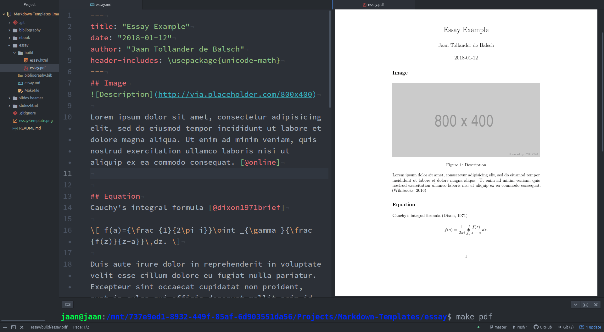

# Markdown Templates


This repository contains templates for creating scientific, academic, and technical documents using *Markdown* and *Pandoc*.  The main advantage of Markdown is its simple syntax compared to pure *LaTeX* while retaining plain text format instead of binary format such as *MS Word* or *Google Docs*. In addition to the basic features of Markdown, Pandoc adds support to equations, citations, code blocks, and vector graphics.

The repository is related to the article [*Scientific Writing with Markdown*](https://jaantollander.com/post/scientific-writing-with-markdown/), which discussed how to write documents using Markdown. The original inspiration came from the article [*How to make a scientific-looking PDF from Markdown (with bibliography)*](https://gist.github.com/maxogden/97190db73ac19fc6c1d9beee1a6e4fc8).


## Requirements
The compilation process requires the following software:

- [*Pandoc*](https://pandoc.org/) for converting between the Markdown files into other document formats.
- [*LaTeX*](https://www.latex-project.org/) for creating PDF documents.
- *Make* (software) for using Makefiles.


## Instructions
Clone the repository and copy the appropriate template directory. We can compile the documents using the Make command:
```bash
make <command>
```
The output will appear in the `BUILDDIR` directory specified by the `Makefile`. For more information about the templates, see the [Template](#templates) section.


## Templates
Each document template contains the following files:

- `<filename>.md` contains the text written in Markdown.
- `bibliography.bib` contains the bibliographic entries in BibTeX format.
- `Makefile` contains the commands for converting the markdown file into the output document format, such as PDF, HTML, or EPUB.

The first lines of the Markdown file contain the Yaml metadata.
```yml
---
title: "Title"
date: \today
author: "Author"
bibliography: "bibliography.bib"
csl: "https://raw.githubusercontent.com/citation-style-language/styles/master/harvard-anglia-ruskin-university.csl"
urlcolor: "blue"
---
```

- We use the `title`, `data`, and `author` variables for creating the title.
- The `bibliography` variable specifies the location of the bibliography file, in this case, `bibliography.bib`. Here is link to some [BibTex style examples](https://verbosus.com/bibtex-style-examples.html).
- The `cls` variable specifies the [citation style](http://citationstyles.org/), and it should point to the location of the citation style file, for example, the path or URL. Different citation styles can be found from [zotero styles](https://www.zotero.org/styles) and [citation styles](https://github.com/citation-style-language/styles).

Pandoc's documentation specifies all the different metadata variables.

The `Makefile` is structured as follows:
```bash
BUILDDIR=build
FILENAME=<filename>

<command>:
    mkdir $(BUILDDIR) -p  # Create the BUILDDIR if it doesn't already exist.
    pandoc $(FILENAME).md \
    ... # Options
```

- `<filename>` is the Markdown filename without the `.md` extension.
- `<command>` is substituted with the name of the document type.
- `pandoc` command creates the output document type. The options followed by the command are specific to the document type.
